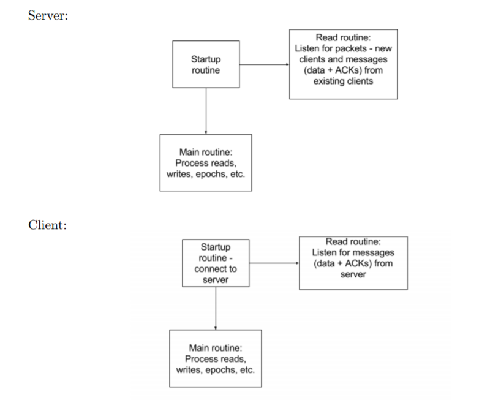

# rdp, reliable datagram protocol

rdp是一个基于udp的可靠的应用层传输协议。

udp在ip上只是添加了基于端口的复用和分用以及差错检测功能，rdp在udp基础上实现可靠传输。

## 动机

实现rdp的动机是在尝试学习分布式入门课程[cmu 15-440](https://www.synergylabs.org/courses/15-440/syllabus.html)时看到的作业[Project 1](https://github.com/cmu-440-f19/P1)，该project中第一步正是实现一个基于udp的应用层可靠传输协议lsp，是的，原名是lsp，即live sequence protocol，这里我把它实现了之后改名成了rdp，即reliable datagram protocol。

project中只给出了rdp的接口定义、消息格式和测试用例，也就是文件client_api.go、server_api.go、rdp\[1-5\]_test.go、message.go、params.go、checksum.go，然后我自己实现了这些接口，即client_impl.go、server_impl.go、eventHeap.go、eventHeap_test.go、sortedList.go、sortedList_test.go、queue.go、queue_test.go、restrictedQueue.go、restrictedQueue_test.go。

## 宏观描述

这里对rdp做一下宏观上的描述，更详细的见[P1.pdf](./P1.pdf)。

1. rdp支持client-server通信模型，server可维护与多个client之间的连接，每个连接由唯一的连接ID标识；
2. 消息传输是可靠的，由序号机制、确认机制、停止等待协议（等待ack）和超时重传保证，这点和tcp一样；
3. 既然要超时重传，就需要和tcp一样对发送的消息编号，不过和tcp将每一个字节进行编号不同，rdp只是将发送的每一个数据报进行编号；
4. 消息可能乱序到达，由rdp将收到的消息按SeqNum排好，按顺序递交给上层应用；
5. 没有显式的连接关闭交互，rdp的任一端在一段时间内没有收到对端的任何消息，即认为连接被关闭/丢失，rdp退出，此后上层应用调用rdp的接口，都会得到错误通知。也因为这个特点，当rdp的一端在一段时间内暂时没有任何数据需要发送时，则rdp需要发送一个心跳，重置对端的连接关闭/丢失的计时器；
6. 类似tcp，rdp设置了发送滑动窗口，只不过窗口大小是静态的，也因此不具备tcp的流量控制功能，只是在一定程度上限制发送端的发送速率，避免接收端缓冲区不足丢弃消息；
7. 类似tcp，如果出现超时，rdp假设网络可能拥塞，采用指数退避策略（2^n）设置一个超时消息的再次重传的时间间隔，避免无脑注入流量，也算是和tcp一样具有简单的拥塞控制的功能了。

## 实现概览

rdp的实现的结构如下：



当一个连接建立时，会在事件堆中放入两个事件，一个是心跳事件，一个是连接关闭/丢失事件。

之后每发送一个消息，都会在堆中放入消息对应的超时事件，如果堆中已有该消息对应的超时事件，那就按照指数退避策略重置事件的超时时间。

在实现rdp的过程中，受到[Advanced Go Concurrency Patterns](https://talks.golang.org/2013/advconc.slide#1)的启发。

超时事件的处理，即全部放入堆中，只用一个计时器监听堆顶，即最先过期的事件，这样就不必每个事件都对应一个计时器来计时，用堆这种容器管理事件也有较好的时间复杂度。这种处理是受到之前看过的[muduo](https://github.com/chenshuo/muduo)的一点源码的启发。

## 遇到的并发bug

```go
for {
	select {
	case ?:
		ch1 <- x
	case y <- ch1:
	}
}
```

在ch1不是buffered channel或者ch1是buffered channel且满的情况下，死锁。

解决思路，一个是先将x写入某个FIFO的动态扩容的容器中，然后每次循环开始时，检查容器，若不为空，则写入ch1，一个循环只能写一个（见[Advanced Go Concurrency Patterns](https://talks.golang.org/2013/advconc.slide#1)）；另一个是临时开线程写，这样临时线程阻塞了也没关系；再一个是开一个常驻线程负责接收然后写入ch1，但这又回到了上面这个模型。

如：

```go
for {
	select {
	case x <- ch:
		ch1 <- x
	}
}
```

若阻塞在写ch1，那么写ch的线程也会阻塞，如果ch不是buffered channel或者满的话。

推荐第一种。

***

```go
// 两个线程：
t1:
	读写数据结构X
	
t2:
	读写数据结构X
```
	
有时，期待t1操作X总是发生在t2操作X之前，并且脑袋里想当然地认为代码就是会这么如期执行，然而如果不加锁互斥的话，就会出现与期望不符的时序，然而因为之前脑袋里就是想当然地认为，所以这时这样的bug反而不容易排查出来。（菜

***

```go
// 两个线程：
t1:
	某条件满足/某事件到达
	通知线程t2
	更新某些数据/数据结构
t2:
	等待t1的通知
	读t1更新的数据/数据结构
```

竞争条件，需要加锁。一个可能是我们期望t1更新完数据后，t2再读，那么这个代码就是错误的，一个是竞争条件，另一个是需要先更新后再通知t2。

## 小小的心得

写单元测试，这样如果后面想要修改某一部分代码，因为有对应的单元测试，修改后，如果对应的单元测试能够跑通，就说明修改没有问题。保证了局部的、小的部分的正确性，系统就不容易出bug，至少出了bug更容易排查（跑一下各部分的单元测试，一一排除）。

## 性能

我是用project给出的测试用例验证了实现的正确性，对于性能并没有去测试，比如对比同样是可靠传输协议的tcp的性能，一个原因也是自己对如何测试性能没有思路，也不知道该测试哪些指标（吞吐量、响应时间等）。

